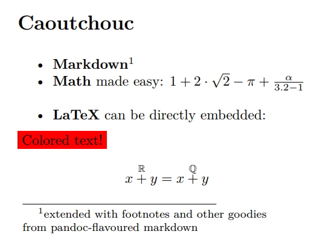

# caoutchouc

> Markdown for formatting + AsciiMath for math + Latex for the weird stuff

## What is caoutchouc?
A replacement for LaTeX based on Markdown and AsciiMath.

## Why use caoutchouc?
Here's the same document written in both LaTeX and Caoutchouc:

| LaTeX                                                                                                                                                                                                                                                                                                                                         | Caoutchouc                                                                 |
|-----------------------------------------------------------------------------------------------------------------------------------------------------------------------------------------------------------------------------------------------------------------------------------------------------------------------------------------------|----------------------------------------------------------------------------|
| \documentclass{article}<br> \usepackage[utf8]{inputenc}<br> \begin{document}<br> <br>     \section{Introduction}<br> <br>     $$\dfrac{1\cdot \alpha}{2}$$<br> <br>     \begin{figure}<br>         \centering<br>         \includegraphics[width=9cm]{image}<br>         \caption{A caption}<br>     \end{figure}<br> <br> \end{document}<br> | <br><br><br><br># Introduction<br> <br> €€(1*alpha)/2€€<br> <br><br><br> \!\[A caption](image.png) <br><br><br><br><br> |

It's easy to see that the Caoutchouc version is much more **readable**, **easy**, **simple** and **less verbose**.

For a detailed explanation of the improvements that Caouchouc brings over LaTeX, read [Why was caoutchouc created?](https://caoutchouc.io/#why-was-it-created).

## Try it!
Go to [ShareCaou.com](http://sharecaou.com/login) and login using:
```
email: test@test.com
password: caoutchouc
```
The site could be slow and may collapse under heavy load, as it's running on a basic VPS.

## Install
**Pre-requisites**: A local installation of texlive.
```
npm install -g caou
```

## Usage
```
caou file.md # Generates file.pdf
```

For more information about the `caou` compiler, run `man caou`.

If you'd like to find out more about caoutchouc, go to [caoutchouc.io](https://caoutchouc.io).

## Caoutchouc example
| Caoutchouc | Result |
|------------|--------|
|# Caoutchouc <br><br>- \*\*Markdown\*\*[^1]<br>- \*\*Math\*\* made easy: €1+2\*sqrt(2)-pi+alpha/(3.2-1)€<br> - \*\*LaTeX*\* can be directly embedded:<br>\usepackage{xcolor}<br>\colorbox{red}{Colored text!}<br><br>$$x\overset{\Bbb{R}}{+} y=x\overset{\Bbb{Q}}{+} y$$<br><br>[^1]: extended with footnotes and many other goodies from pandoc-flavoured markdown |  <br>&nbsp;&nbsp;&nbsp;&nbsp;&nbsp;&nbsp;&nbsp;&nbsp;&nbsp;&nbsp;&nbsp;&nbsp;&nbsp;&nbsp;&nbsp;&nbsp;&nbsp;&nbsp;&nbsp;&nbsp;&nbsp;&nbsp;&nbsp;&nbsp;&nbsp;&nbsp;&nbsp;&nbsp;&nbsp;&nbsp;&nbsp;&nbsp;&nbsp;&nbsp;&nbsp;&nbsp;&nbsp;&nbsp;&nbsp;&nbsp;&nbsp;&nbsp;&nbsp;&nbsp;&nbsp;&nbsp;&nbsp;&nbsp;&nbsp;&nbsp;&nbsp;&nbsp;&nbsp;&nbsp;&nbsp;&nbsp;&nbsp;&nbsp;&nbsp;&nbsp;&nbsp;&nbsp;&nbsp;&nbsp;&nbsp;&nbsp;&nbsp;&nbsp;&nbsp;&nbsp;&nbsp;&nbsp;&nbsp;&nbsp;&nbsp;&nbsp;&nbsp;&nbsp;&nbsp; |

Go to [caoutchouc.io](https://caoutchouc.io) for proper documentation.

## Contributing
All contributions are welcome but help is specially appreciated in the following tasks:
- [ ] Set up scalable hosting for [ShareCaou](https://github.com/corollari/sharecaou) (currently it's in a simple vps). I can pay for all the hosting costs.
- [ ] Create a logo for Caoutchouc (primary use will be in ShareCaou).
- [ ] Provide feedback on how to improve it, bugs that you find...

## Why is it called caoutchouc?
Caoutchouc is the name that the indigenous people of South America used for the rubber material that is obtained from vulcanizing latex (the tree sap).

## What makes caoutchouc different from plain pandoc?
- **AsciiMath**: pandoc doesn't support it, caoutchouc does.
- **LaTeX**: caoutchouc supports the direct embedding of LaTeX but pandoc doesn't (it does in an undocumented way which is extremely limited, caoutchouc improves this).
- **Ease of use**: ShareCaou makes caoutchouc much easier to use for most people compared to pandoc (which at the very least requires a local installation of pandoc & texlive).

## Acknowledgements
- Pandoc is a fundamental component of caoutchouc.
- The code used to convert asciimath to latex was taken from [here](https://github.com/asciimath/asciimathml/blob/master/asciimath-based/ASCIIMathTeXImg.js). For more information check the License text in `ASCIIMathTeXImg.js`.

